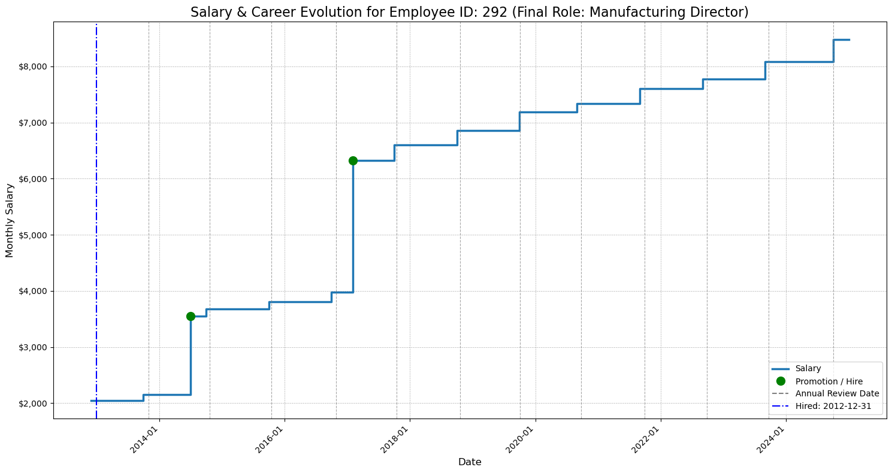
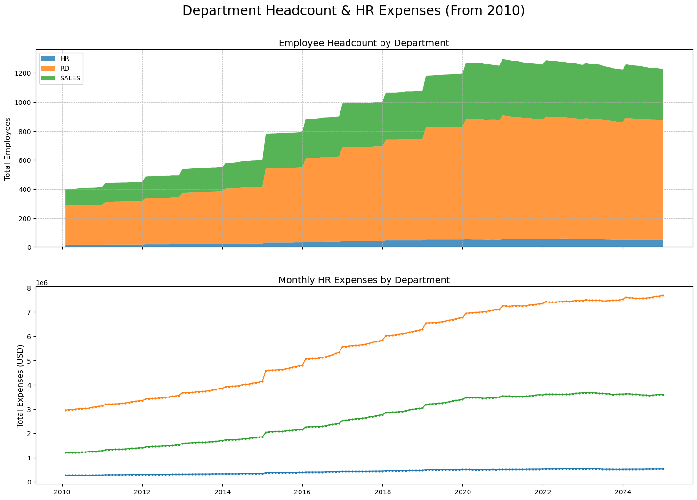
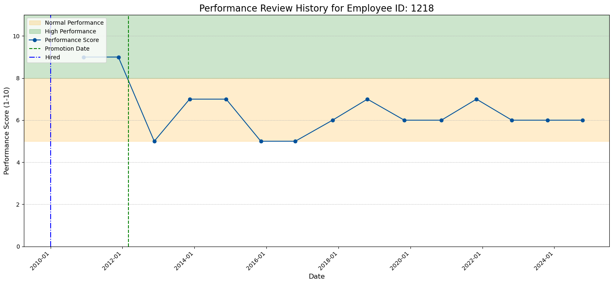

# Synthetic Historical Workforce Data Generation

This project was undertaken to solve a common problem in HR and Finance analytics: the lack of historical data. Often, we only have a single "snapshot" of our workforce at one point in time. My goal was to take such a snapshot—the well-known IBM HR Attrition dataset—and reverse-engineer a plausible, dynamic history for every single employee.

The final output is not a single analytical table, but a set of raw, timestamped **event logs**. These logs simulate the output of different source systems (HRIS, Performance Management, etc.) over time. This approach provides a rich, realistic foundation for building and testing a full-scale Data Warehouse (DWH) and ELT pipeline.

In essence, I turned a static photograph of the company into a full-length movie for every employee, and then saved each important scene as a timestamped event record.

## 1. The Core Logic: Plausible Career Paths

The foundation of this simulation is a defined set of "career path rules." I analyzed the source `attrition.csv` to understand the valid combinations of `JobRole`, `JobLevel`, and `Department`. This analysis formed the basis of a "demotion map" that allows the script to walk backward in an employee's career, ensuring every simulated move is logical and stays within departmental boundaries.

### The Career Model I Implemented:

- **Human Resources Department:**

  - **Path:** `Human Resources (L1)` → `Human Resources (L2)` → `Manager (L4)` → `Manager (L5)`

- **Sales Department:**

  - **Path:** `Sales Representative (L1)` → `Sales Executive (L2)` → `Sales Executive (L3)` → `Manager (L4)` → `Manager (L5)`

- **Research & Development Department:**
  - **Path A (Lab):** `Laboratory Technician (L1)` → `Laboratory Technician (L2)` → `Research Scientist (L1)` or `Manufacturing Director (L2)`
  - **Path B (Science):** `Research Scientist (L1)` → `Research Scientist (L2)` → `Manager (L3-L5)` or `Research Director (L3-L5)`
  - **Path C (Healthcare):** `Healthcare Representative (L2)` → `Healthcare Representative (L3)` → `Manager (L4-L5)`
  - **Path D (Manufacturing):** `Manufacturing Director (L2)` → `Manufacturing Director (L3)` → `Manager (L4-L5)`
  - **Cross-Functional Moves:** I modeled that high-level Scientists or Directors could become Managers, and that Managers could become Research Directors, reflecting common internal mobility patterns.

## 2. Final Deliverables: The Generated Log Files

The script produces four primary log-style CSV files, sorted chronologically.

1.  **`hris_employees_log.csv`**: The core employee record log.

    - **Columns**: `event_date`, `employee_id`, `full_name`, `email`, `job_level`, `job_role`, `department_name`, `salary`, `is_currently_active`.

2.  **`reviews_log.csv`**: A log of annual performance reviews.

    - **Columns**: `review_date`, `employee_id`, `performance_score`, `salary_hike_percent`, `bonus_granted`.

3.  **`survey_results_log.csv`**: A log of quarterly employee satisfaction surveys.

    - **Columns**: `survey_date`, `employee_id`, `env_satisfaction_score`, `job_involvement_score`, `relationship_satisfaction_score`, `job_satisfaction_score`.

4.  **`erp_financials_log.csv`**: A monthly aggregated financial log derived from the HRIS data.
    - **Columns**: `period_end_date`, `department_code`, `actual_revenue`, `actual_expenses`, `employee_headcount`.

Additionally, the script includes a bonus function to generate monthly **snapshot files** from these logs, simulating how a transactional database might look at the end of each month. These are saved in the `snapshots/` directory.

## 3. The Generation Methodology

I broke the process down into three main phases, working backward from a defined "snapshot date" (`2024-12-31`).

### Phase I: Setup and Timeline Establishment

1.  **Load & Prep Data**: I loaded the `attrition.csv` file, converted column names from `CamelCase` to `snake_case` for easier use, and segmented the employees into `active` and `attritted` populations.
2.  **Establish Timelines**: For each employee, I calculated a `hire_date` and `termination_date`.
    - **Active Employees**: `hire_date` = `snapshot_date` - `TotalWorkingYears`.
    - **Attritted Employees**: I first generated a random `termination_date` within the last 5 years, and then calculated `hire_date` = `termination_date` - `TotalWorkingYears`.
3.  **Define "Game Rules"**: I centralized all simulation rules into a single `CONFIG` dictionary. This includes:
    - **`DEPROMOTION_MAP`**: The core logic for back-casting career paths. It maps a `(JobRole, JobLevel)` tuple to a list of possible _prior_ roles.
    - **`TENURE_RANGES_YEARS`**: A dictionary defining the realistic number of years an employee might spend at each `JobLevel`.
    - **`SALARY_BANDS`**: I pre-calculated salary bands for every `(JobRole, JobLevel)` by taking the min/max `MonthlyIncome` from the source data and adding a 10% buffer. This was crucial for sanity-checking generated salaries.

### Phase II: Generating Individual Event Histories (Backcasting)

1.  **Core Career History**: For each employee, I started at their final role and worked backward. In a loop, I used the `get_previous_role()` function and `DEPROMOTION_MAP` to find a valid prior role. I then generated a tenure for that role using `TENURE_RANGES_YEARS`. This process continued until an entry-level role was reached, creating a chain of "Promotion" events.

2.  **Performance & Survey History (The Causality Engine)**:

    - **Performance-for-Promotion**: To make the data logical, I programmatically ensured that for the two annual reviews immediately preceding a promotion, the employee's `performance_score` was high (8-10).
    - **Satisfaction-for-Attrition**: For employees who left the company, I simulated a two-stage decline in their survey scores. A gentle negative drift was applied from 18 to 6 months before termination, followed by a much sharper drop in the final 6 months.

3.  **Salary History**: This was a complex but critical step. I didn't just generate a single salary for each role. Instead, I created a detailed monthly salary history. I identified all key event dates for an employee (hire, promotions, annual reviews) and worked backward from their final salary. At each event boundary, I "undid" the relevant salary increase: a large promotion hike, or a smaller annual performance/COLA hike. This created a realistic, step-wise salary progression for every employee.

### Phase III: Final Consolidation and Aggregation

1.  **Assemble Logs**: I consolidated all the individual event records generated in Phase II into the final, globally sorted CSV log files.
2.  **Generate ERP Financials**: Using the completed `hris_employees_log.csv`, I ran an aggregation process. For each month of the simulation, I calculated the active headcount and total salary expense for each department. I also simulated departmental revenue based on headcount in revenue-generating departments (Sales and R&D).

## 4. Code Structure

To keep the project manageable and tunable, I followed two main principles:

- **`CONFIG` Dictionary**: All rules, constants, file paths, and simulation parameters are stored in a single, large `CONFIG` dictionary at the top of the script. This allows for easy modification of the simulation's behavior without altering the core logic.
- **Modular Functions**: The logic is decomposed into small, single-purpose functions like `generate_tenure_dates()`, `get_previous_role()`, `generate_erp_financials_log()`, etc. The main script body orchestrates calls to these functions, making the overall process easy to follow.

## 5. Validation and Quality Checks

To ensure the generated data was believable, I built several validation visualizations.

#### Plot 1: Individual Salary & Career Evolution

This plot tracks a single employee's salary over time. The step-wise increases clearly align with promotion events (marked with green circles) and annual review cycles (marked with dashed gray lines), confirming the salary logic is working as intended.



#### Plot 2: Company-Wide Growth Trends

This plot shows the aggregated headcount and HR expenses over time, broken down by department. The gradual, steady growth confirms that the simulation is stable and doesn't produce wild, unrealistic fluctuations.



#### Plot 3: Individual Performance History

This visualization shows an employee's performance scores over time. You can see the scores are typically in the "Normal" range but spike into the "High" range just before a promotion date (marked with a green dashed line), validating the "performance-for-promotion" causality rule.



## 6. How to Run the Project

### Prerequisites

- You must have **Anaconda** or **Miniconda** installed on your system to manage the project environment.
- You will need the source data file: `attrition.csv`.

### Step-by-Step Instructions

1.  **Clone the Repository**
    Clone this repository to your local machine using the following command:

    ```bash
    git clone https://github.com/IhebBelhadj/synthetic-time-series-hr-data.git
    cd synthetic-time-series-hr-data
    ```

2.  **Set Up the Input Data Directory**
    The script expects the source data to be in a specific location.

    - Create a directory named `input_data` in the root of the project.
    - Place your `attrition.csv` file inside this new directory.

    Your project structure should now look like this:

    ```
    .
    ├── data_gen_project.ipynb
    ├── env.yml
    ├── input_data/
    │   └── attrition.csv
    └── README.md
    ```

3.  **Create and Activate the Conda Environment**
    The `env.yml` file contains all the necessary Python packages and their specific versions to ensure the code runs correctly.

        - **Create the environment** from the `env.yml` file. This command will set up an environment named `data-env`.
          ```bash
          conda env create -f env.yml
          ```
        - **Activate the environment**. You must do this every time you work on the project.
          `bash

    conda activate data-env
    `      Your command prompt should now show`(data-env)` at the beginning, indicating the environment is active.

4.  **Launch Jupyter and Run the Notebook**
    With the `data-env` environment active, start a Jupyter Notebook session:

    ```bash
    jupyter notebook
    ```

    This command will open a new tab in your default web browser showing the Jupyter file explorer.

    - Navigate to and open the **`generate_data.ipynb`** notebook.
    - Execute the cells sequentially from top to bottom by clicking "Run" or using the shortcut `Shift + Enter`.

The script will print its progress to the notebook output. Upon completion, you will find the generated log files in a new directory named **`generated_raw_data/`** and the monthly snapshots in **`snapshots/`**.
